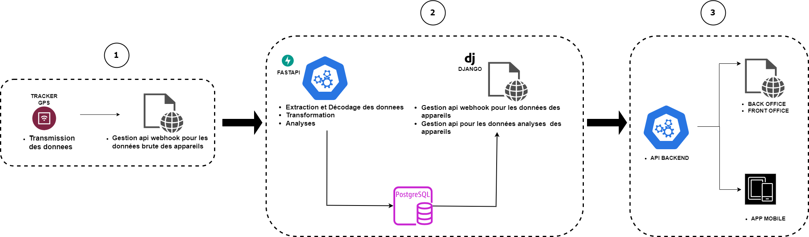
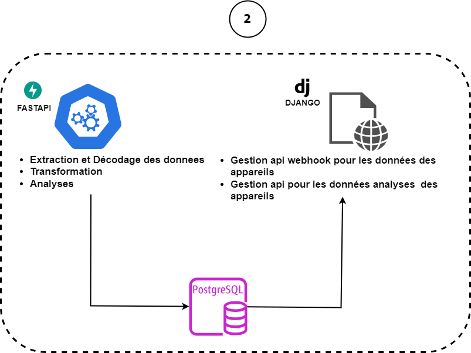
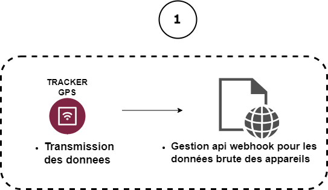
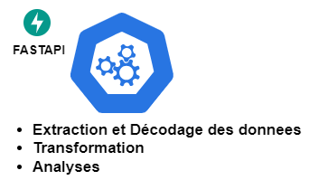
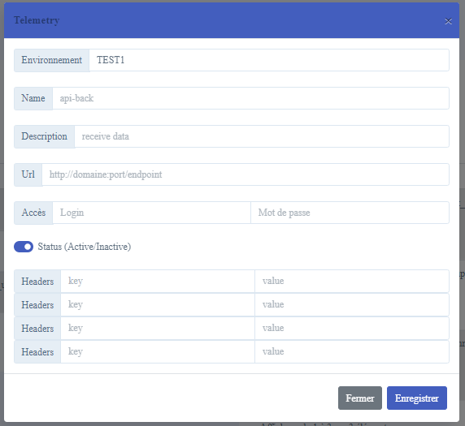
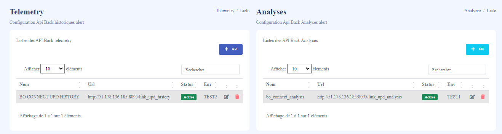

# iot-data-pipeline
Une solution de pipeline de données d'Internet des Objets (IoT) pour surveiller les animaux et leur état de santé

# Workflow général



## Description
Une solution de pipeline de données d'Internet des Objets (IoT) conçue pour connecter et surveiller les animaux ainsi que leur état de santé. Le système permet fournir des diverses données en temps réel  et d'assurer une gestion efficace de la santé animale.
Ce projet s'appuie sur la plateforme Digital Matter, qui fournit des trackers GPS spécialement conçus pour être fixés sur les animaux. Ces dispositifs permettent de recueillir des données de localisation et de mouvement précises.
Dans le cadre de ce projet, on travail dans la section numéro 2 du workflow général



# Les Étapes Clés:
## Réception des Données Brutes via Webhook de Digital Matter :

Digital Matter offre une webhook pour recevoir les données brutes provenant des trackers GPS. Ces données incluent les informations de localisation et d'autres metriques des animaux suivis.




## Création d'une API de Traitement des Données :

Une API capable de recevoir ces données brutes. Cette API effectue plusieurs opérations :
Transformation des données pour les rendre exploitables.
Calcul de diverses métriques pertinentes.
Analyse approfondie des données pour obtenir des informations significatives.



## Proposition d'un Webhook pour la Surveillance en Temps Réel :

Afin de fournir des données de surveillance en temps réel, j'ai mis en place un webhook qui transmet ces informations transformées et analysées à d'autres systèmes ou applications. Les données envoyées incluent :
Données de Surveillance : Informations en temps réel sur la localisation  des animaux.
Données d'Activité des Animaux : Détails sur les mouvements, les distances parcourues, et d'autres métriques.
Données d'Analyse : Calculs avancés tels que la distance totale parcourue, les variations d'altitude (dénivelé), l'indice de température et d'humidité (THI), etc.




## Fonctionnalités
- Collecte et analyse des données de santé
- Webhook pour les données surveillance et d'activités en temps réel des animaux
- Webhook pour les données d'analyses
- Interface utilisateur intuitive pour mettre les api qui recoivent les données


## Outils et Technologies
Le projet utilise les technologies et outils suivants :
- **Langages de programmation** : Python, JavaScript, HTML, css
- **Frameworks et bibliothèques** : Fastapi, Django, jquery, datatable, bootstrap shapely 
- **Bases de données** : PostgreSQL, SQL
- **Formats de données** : JSON, JWT
- **Conteneurisation** : Docker
- **Plateforme de télématique** : Digital Matter, Oem server, Telematics Guru


## Format de données surveillance
```
[
    {
        "all_date_heure": "2024-05-28 05:31:21",
        "all_type": "Tracker",
        "all_lat": 55.0216548,
        "all_lng": 19.0216548,
        "tracker_activity": 1,
        "tracker_reason": "Tag Data",
        "tracker_delay": 17352891,
        "tracker_sn": "S-TRACKER-001",
        "tracker_gps_age": null,
        "tracker_speed": null,
        "tracker_used_speed_limit": null,
        "tracker_speed_band": null,
        "tracker_local_speed_limit": null,
        "tracker_speed_acc": null,
        "tracker_heading_degrees": null,
        "tracker_alt": 8825,
        "tracker_pos_acc": null,
        "tracker_pdop": null,
        "tracker_gps_fix_ok": "true",
        "tracker_gps_fix_3d": "true",
        "tracker_din": 2,
        "tracker_dout": 0,
        "tracker_driver_id": null,
        "tracker_trip_type_code": null,
        "tracker_project_code": null,
        "tracker_analog1": 5.4,
        "tracker_analog2": null,
        "tracker_analog3": 16,
        "tracker_analog4": 8,
        "tracker_analog5": 5378,
        "tracker_analog6": null,
        "tracker_analog7": null,
        "tracker_analog8": null,
        "tracker_analog9": null,
        "tracker_analog10": null,
        "tracker_analog11": null,
        "tracker_analog12": null,
        "tracker_analog13": null,
        "tracker_analog14": null,
        "tracker_analog15": null,
        "tracker_analog16": null,
        "tracker_analog17": null,
        "tracker_analog18": null,
        "tracker_analog19": null,
        "tracker_analog20": null,
        "tag_mac_address": null,
        "tag_gateway": "S-TRACKER-001",
        "tag_gateway_pos_acc": null,
        "tag_gateway_speed": null,
        "tag_status": null,
        "tag_battery_voltage": null,
        "tag_rssi": null,
        "tag_tx_power": null,
        "tag_x_acc": null,
        "tag_y_acc": null,
        "tag_z_acc": null,
        "timezone": "+0000"
    }
]
```

## Format de données analyse
```
[
    {
        "serialNumber" : {
            "individualBase": {
                "general": {
                    "deniveleAverageDaily": 2750.5,
                    "distanceAverageDaily": 0
                },
                "diurnal": {
                    "deniveleAverageDaily": 2750.5,
                    "distanceAverageDaily": 0
                },
                "nocturnal": {
                    "deniveleAverageDaily": null,
                    "distanceAverageDaily": null
                }
            },
            "dailyPerformance": {
                "altitudeAverage": 3005.8636363636365,
                "altitudeMin": 824,
                "altitudeMax": 5825,
                "temperatureAverage": 16,
                "temperatureMax": 16,
                "temperatureMin": 16,
                "denivelePositive": 5001,
                "distanceTraveled": 0.00295452570143757,
                "distanceTraveledDiurnal": 0,
                "distanceTraveledNocturnal": null,
                "indexTHIPersonal": 15.802,
                "deniveleDiurnal": 5001,
                "deniveleNocturnal": 5001,
                "energyExpenseGeneral": 0.0000014397120575884822,
                "energyExpenseDiurnal": 0.0000020303631581376035,
                "energyExpenseNocturnal": null
            },
            "localWeather": {
                "precipitation": 5.13,
                "cloudCover": 8.5,
                "temperatureMax": 24.9,
                "temperatureMin": 12.8,
                "humidityLevel": 76,
                "WindSpeedMax": 28.8,
                "pressure": null,
                "lunarCycle": null,
                "indexTHI": 23.527199999999997
            }
        }
    }
]
```


## Installation
Pour installer et exécuter ce projet localement, veuillez suivre les étapes ci-dessous :

1. Clonez le dépôt :
    ```bash
    git clone -b main --depth=1  https://github.com/hanyfy/iot-data-portfolio.git
    ```

2. Accédez au répertoire du projet :
    ```bash
    cd iot-data-portfolio/source
    ```

3. Run :
    ```bash
    docker-compose up --build
    ```

4. Installer les tables du base de données (PostgreSQL).
    ```
    Se connecter sur la base de données avec PgAdmin v4 
        POSTGRES_HOST=localhost
        POSTGRES_PORT=5432
        POSTGRES_USER=root
        POSTGRES_PASSWORD=F7wB2nK9v
    Exécuter les fichiers sql    
        BDD/iot_table.sql
        BDD/iot_table_v2.sql
    ```    

5. Accédez à l'application via votre navigateur à l'adresse :
    ```
    http://127.0.0.1:8086/docs (pour la documentation de l'api)
    http://127.0.0.1:8085 (pour l'ihm de webhook)
    ```

## Utilisation
1. Creer-vous un acces utilisateur sur django et connectez-vous à l'application webhook.
3. Configurez votre api qui recoit les données à l'application webhook.



## Contribution
Les contributions sont les bienvenues ! Si vous souhaitez contribuer, veuillez créer une branche à partir de `main`, apporter vos modifications, puis soumettre une pull request.

## Licence
Ce projet est sous licence MIT. Pour plus de détails, veuillez consulter le fichier `LICENSE`.

## Auteurs
- [RAMAMONJISOA Nomenjanahary Hany Fy](https://github.com/hanyfy)
- [ramamonjisoafy@gmail.com](https://github.com/hanyfy)

Merci de votre intérêt pour ce projet ! N'hésitez pas à me contacter pour toute question ou suggestion.
